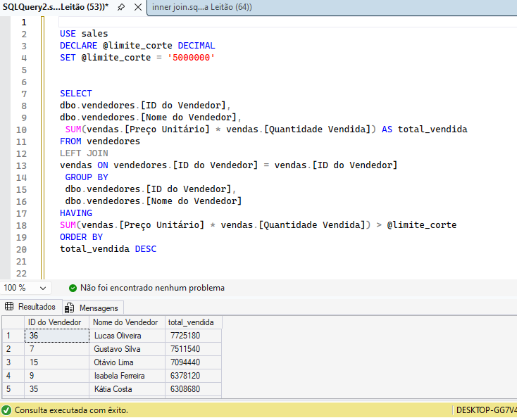

# 📊 Análise de Vendas por Vendedor (SQL Server)

Este projeto contém uma consulta SQL que **retorna o total vendido pelos vendedores que venderam a partir de 5.000.000**.

## 🎯 Objetivo
Identificar os vendedores com maior volume de vendas, considerando apenas aqueles cujo total vendido seja **maior ou igual a 5.000.000**.

## 🛠️ Tecnologias
- SQL Server
- T-SQL

## 📌 Conceitos aplicados
- JOIN entre tabelas
- Funções de agregação (SUM)
- GROUP BY
- HAVING
- Uso de variáveis
- Ordenação por métricas de negócio

## 📄 Consulta SQL
🔗 [Ver consulta SQL](consulta_total_vendido_por_vendedor.sql)

## 📈 Resultado da consulta

